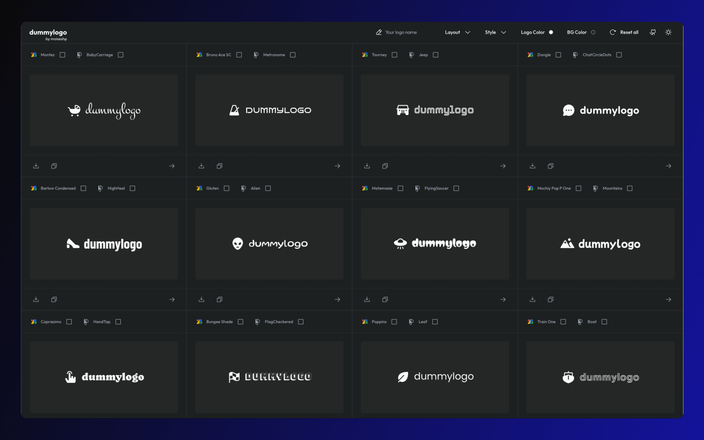

  

  <a href="https://dummylogo.vercel.app" target="_blank">
    Live Demo
  </a>

 

## 📦 Stack

- [**NextJS**](https://nextjs.org/) - The React Framework for the Web.
- [**Typescript**](https://www.typescriptlang.org/) - JavaScript with syntax for types.
- [**Tailwindcss**](https://tailwindcss.com/) - A utility-first CSS framework.
- [**Phosphor Icons**](https://phosphoricons.com/) - Flexible icon family for interfaces.
- [**Google Fonts**](https://fonts.google.com/) - Making the web more beautiful, fast, and open through great typography.

## 🤝 Contributing

If you find this project useful, feel free to leave a star ⭐️! Contributions, issues, and feedback are welcome.

## 📄 License

This project is licensed under the [MIT](LICENSE).
